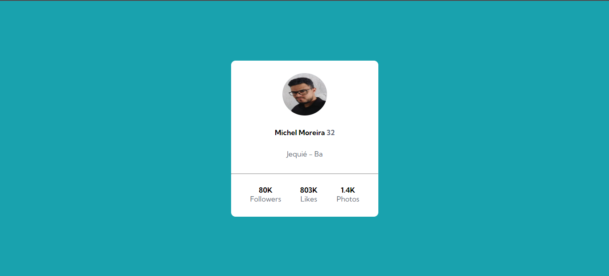
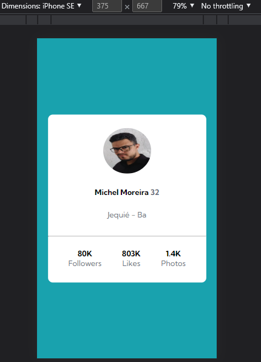

# Profile Card

Exercício para a criação de um cartão de perfil usando ***HTML*** e ***CSS***, provando as habilidades com tags semânticas e o alinhamento de items e elementos com o flexbox.

## Versão Desktop

## Versão responsiva para Mobiles

