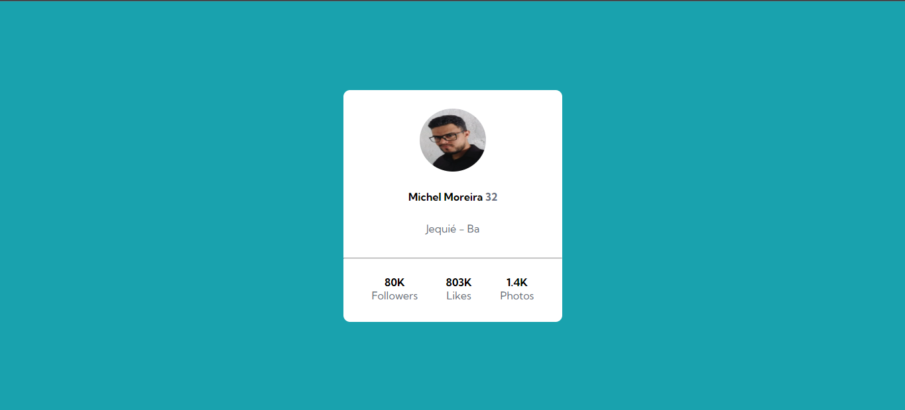

# Profile Card

Exercício para a criaçãode um cartão de perfil usando *HTML* e *CSS*, provando as habilidades com tags semânticas e o alinhamento de items e elementos com o flexbox.

## Versão Descktop

[]

## Versão responsiva para Mobiles

[]
