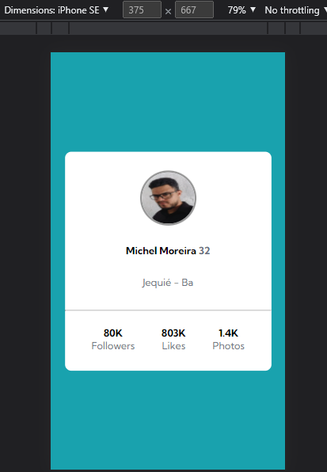

# Profile Card

Exercício para a criação de um cartão de perfil usando ***HTML*** e ***CSS***, provando as habilidades com tags semânticas e o alinhamento de items e elementos com o flexbox. Usando conceitos de divisões de responsabilidade das folhas de estilo em: *estilo*, *reset* e *variáveis* em ***CSS***.

## Versão Desktop

## Versão responsiva para dispositivos Mobiles

